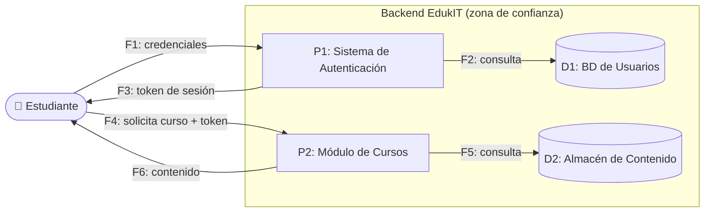

# 🧭 Guía Paso a Paso: Evaluación de Seguridad con STRIDE

Esta guía complementa el `README.md` del taller. Su objetivo es que, antes de analizar un flujo crítico de EdukIT en clase (Parte 1) o del sistema del cliente real (Parte 2), el equipo tenga una referencia clara del marco STRIDE y de la metodología para pasar de "dibujar el flujo" a "priorizar amenazas reales".

El diagrama de ejemplo de esta guía está escrito en [Mermaid](https://mermaid.js.org/) y se renderiza automáticamente al ver este archivo en GitHub.

---

## 1. Las 6 categorías de STRIDE

| Categoría | Pregunta guía | Ejemplo típico |
|---|---|---|
| **S**poofing (Suplantación) | ¿Alguien puede hacerse pasar por otro usuario o sistema? | Credenciales robadas, phishing |
| **T**ampering (Alteración) | ¿Alguien puede modificar datos o mensajes sin autorización? | Interceptar y modificar un token en tránsito |
| **R**epudiation (Repudio) | ¿Alguien puede negar haber realizado una acción? | Falta de logs de auditoría |
| **I**nformation Disclosure (Divulgación) | ¿Puede exponerse información que debería ser privada? | Consulta sin control de acceso, backup expuesto |
| **D**enial of Service (Denegación de servicio) | ¿Puede alguien dejar el sistema o un componente inaccesible? | Saturación de solicitudes |
| **E**levation of Privilege (Elevación de privilegios) | ¿Puede alguien obtener permisos mayores a los que le corresponden? | Manipular el rol en una solicitud |

---

## 2. Metodología en 5 pasos

STRIDE no se aplica "en el aire": se aplica sobre un diagrama de flujo de datos (DFD) del proceso. Sin ese diagrama, las amenazas terminan siendo genéricas.

1. **Elegir el flujo y dibujar su DFD** — represente el flujo crítico como actores externos, procesos, almacenes de datos y los flujos entre ellos, marcando el límite de confianza (qué está dentro y qué está fuera del control del sistema).
2. **Identificar los elementos a analizar** — liste cada proceso, almacén de datos y flujo del DFD; cada uno es candidato a amenazas.
3. **Aplicar las 6 categorías STRIDE** — para cada elemento relevante, formule la amenaza concreta en cada categoría que aplique (no todas las categorías aplican a todos los elementos).
4. **Evaluar impacto y proponer mitigación** — para cada amenaza identificada, describa su impacto y un control concreto que la mitigue.
5. **Priorizar por riesgo** — combine impacto y probabilidad para asignar un nivel de riesgo a cada amenaza y ordene la tabla de mayor a menor riesgo.

---

## 3. Ejemplo guiado: Acceso de estudiantes a cursos y materiales (EdukIT)

### Paso 1 — Elegir el flujo y dibujar su DFD

Se elige el flujo de **acceso de estudiantes a cursos y materiales**: el estudiante se autentica y luego solicita el contenido de un curso. Se marca el límite de confianza entre el estudiante (fuera del control de EdukIT) y el backend (dentro).



### Paso 2 — Identificar los elementos a analizar

| ID | Elemento | Tipo |
|---|---|---|
| E1 | Estudiante | Actor externo |
| P1 | Sistema de Autenticación | Proceso |
| P2 | Módulo de Cursos | Proceso |
| D1 | BD de Usuarios | Almacén de datos |
| D2 | Almacén de Contenido | Almacén de datos |
| F1–F6 | Flujos de datos entre los anteriores | Flujo |

### Paso 3 — Aplicar las 6 categorías STRIDE

Se formula una amenaza concreta por categoría, señalando el elemento exacto sobre el que ocurre y qué control ya existe hoy frente a ella (todavía sin impacto ni mitigación — eso se agrega en el Paso 4):

| ID | Componente / Activo | Tipo STRIDE | Descripción de la Amenaza | Escenario de Ataque | Controles de Seguridad Existentes |
|---|---|---|---|---|---|
| T1 | Sistema de Autenticación (P1) / Credenciales (F1) | Spoofing | Un atacante se hace pasar por un estudiante usando credenciales robadas o phishing. | Atacante usa credenciales robadas vía phishing para iniciar sesión. | Autenticación con usuario y contraseña, sin MFA. |
| T2 | Token de sesión (F3) | Tampering | El token de sesión es interceptado y modificado en tránsito si la comunicación no usa TLS. | Atacante intercepta la comunicación en una red no segura (ej. WiFi público) y modifica el token antes de que llegue al servidor. | Comunicación cifrada con HTTPS en el flujo principal, sin verificación de firma del token en cada solicitud. |
| T3 | Sistema de Autenticación (P1) — registro de acciones | Repudiation | Un estudiante o administrador realiza una acción sensible (ej. cambia una nota) y luego niega haberlo hecho, por falta de registro de auditoría. | Un docente cambia una calificación desde el panel y luego niega la acción al no existir registro con marca de tiempo y usuario. | Registro de accesos básico, sin logs de auditoría con marca de tiempo y usuario para acciones sensibles. |
| T4 | BD de Usuarios (D1) | Information Disclosure | Exposición de datos personales o notas académicas por una consulta sin control de acceso adecuado. | Atacante explota un endpoint de consulta sin validar permisos y descarga el historial académico de otros estudiantes. | Control de acceso a nivel de aplicación, sin validación de permisos a nivel de consulta a la BD. |
| T5 | Módulo de Cursos (P2) | Denial of Service | Un atacante satura las solicitudes de contenido y deja el módulo de cursos inaccesible durante un examen. | Atacante lanza un ataque de flooding contra el endpoint de contenido de cursos durante la semana de exámenes. | Balanceador de carga básico, sin límite de tasa (rate limiting) configurado. |
| T6 | Solicitud de curso con rol (F4) | Elevation of Privilege | Un estudiante manipula el parámetro de rol en la solicitud para acceder a funciones de docente o administrador. | Estudiante modifica manualmente el campo `role` en el payload de la solicitud para obtener acceso de administrador. | Validación de rol en el cliente (frontend), sin revalidación estricta en el servidor. |

### Paso 4 — Evaluar impacto y proponer mitigación

Se completan las columnas restantes de la plantilla oficial (impacto, probabilidad, nivel de riesgo, mitigación, responsable y estado), llegando así a la tabla combinada final con las 12 columnas de `plantilla_analisis_stride.xlsx` — esta es la tabla que se entrega como `tabla-stride-clase.xlsx`:

| ID | Componente / Activo | Tipo STRIDE | Descripción de la Amenaza | Escenario de Ataque | Impacto | Probabilidad | Nivel de Riesgo | Controles de Seguridad Existentes | Mitigación Recomendada | Responsable | Estado |
|---|---|---|---|---|---|---|---|---|---|---|---|
| T1 | Sistema de Autenticación (P1) / Credenciales (F1) | Spoofing | Un atacante se hace pasar por un estudiante usando credenciales robadas o phishing. | Atacante usa credenciales robadas vía phishing para iniciar sesión. | Alto — acceso no autorizado a la cuenta y sus datos | Media | **Alto*|| Autenticación con usuario y contraseña, sin MFA. | Autenticación multifactor (MFA) y bloqueo tras intentos fallidos | Equipo | Seguridad | Pendiente |
| T2 | Token de sesión (F3)| Tampering | El token de sesión es interceptado y modificado en tránsito si la comunicación no usa TLS. | Atacante intercepta la comu|cación en una red no segura (ej. WiFi público) y modifica el token antes de que llegue al servidor. | Alto — secuestro de sesión activ|| Baja | Medio | Comunicación cifrada con HTTPS en el flujo principal, sin verificación de firma del token en cada solicitud. | Forzar|TTPS/TLS en todas las comunicaciones y firmar/verificar el token (JWT) | Equipo Backend | En análisis |
| T3 | Sistema de Autentica|ón (P1) — registro de acciones | Repudiation | Un estudiante o administrador realiza una acción sensible (ej. cambia una nota) y lue| niega haberlo hecho, por falta de registro de auditoría. | Un docente cambia una calificación desde el panel y luego niega la acci| al no existir registro con marca de tiempo y usuario. | Medio — dificulta resolver disputas académicas | Media | Medio | Registro de|ccesos básico, sin logs de auditoría con marca de tiempo y usuario para acciones sensibles. | Registro de auditoría (logs) con marca | tiempo y usuario para acciones sensibles | DevOps | Pendiente |
| T4 | BD de Usuarios (D1) |Information Disclosure | Exposición de datos personales o notas académicas por una consulta sin control de acceso adecuado. | Atacante|xplota un endpoint de consulta sin validar permisos y descarga el historial académico de otros estudiantes. | Alto — incum|imiento de protección de datos (Ley 1581) | Media | **Alto** | Control de acceso a nivel de aplicación, sin validación de permisos a ni|l de consulta a la BD. | Cifrado en reposo y control de acceso basado en roles (RBAC) a nivel de consulta | Equipo de Arquitectura | En|rogreso |
| T5 | Módulo de Cursos (P2|| Denial of Service | Un atacante satura las solicitudes de contenido y deja el módulo de cursos inaccesible durante un exam|. | Atacante lanza un ataque de flooding contra el endpoint de contenido de cursos durante la semana de exámenes. | Medio — interru|ión temporal del servicio | Baja | Bajo | Balanceador de carga básico, sin límite de tasa (rate limiting) configurado. | Límite de ta| (rate limiting) y auto-escalado con balanceo de carga | Infraestructura | Pendiente |
| T6 | Solicitud de curso c| rol (F4) | Elevation of Privilege | Un estudiante manipula el parámetro de rol en la solicitud para acceder a funciones de doce|e o administrador. | Estudiante modifica manualmente el campo `role` en el payload de la solicitud para obtener acceso de administr|or. | Alto — control total sobre contenido o calificaciones ajenas | Baja | Medio | Validación de rol en el cliente (frontend), sin rev|idación estricta en el servidor. | Validar el rol en el servidor en cada solicitud; nunca confiar en el rol enviado por el cliente | Eq|po de Seguridad | En análisis |

### Paso 5 — Priorizar por |esgo

A partir de la tabla comple| del Paso 4, se construye una vista priorizada: se ordenan los ID por `Nivel de Riesgo` de mayor a menor. El detalle completo (impact| probabilidad, controles existentes, mitigación, responsable y estado) permanece en la tabla del Paso 4; aquí solo se resume lo nece|rio para decidir qué atender primero.

| Prioridad | ID | Tipo STR|E | Componente / Activo | Nivel de Riesgo |
|---|---|---|---|---|
| 1 | T4 | Information Disc|sure | BD de Usuarios (D1) | **Alto** |
| 2 | T1 | Spoofing | Siste| de Autenticación (P1) / Credenciales (F1) | **Alto** |
| 3 | T6 | Elevation of Pri|lege | Solicitud de curso con rol (F4) | Medio |
| 4 | T2 | Tampering | Toke|de sesión (F3) | Medio |
| 5 | T3 | Repudiation | Si|ema de Autenticación (P1) — registro de acciones | Medio |
| 6 | T5 | Denial of Servic|| Módulo de Cursos (P2) | Bajo |

---

## 4. Práctica guiada: labo|torio con OWASP Juice Shop

Hasta aquí STRIDE se trabaj|sobre el papel. Esta práctica es opcional pero muy recomendada en la sesión de clase: se hace lo mismo, pero **ejecutando el ataque|e verdad** contra una aplicación construida a propósito para esto, para que la amenaza deje de ser un párrafo abstracto.

📎 Los 6 mecanismos y los 4|etos de esta sección están diagramados de forma interactiva en [`clase/modelado-de-amenazas.html`](modelado-de-amenazas.html)| útil para presentar en clase antes de que cada equipo entre a Juice Shop.

**[OWASP Juice Shop](https:|owasp.org/www-project-juice-shop/)** es una tienda en línea deliberadamente vulnerable, publicada por OWASP específicamente para entren|iento de seguridad — no es un sistema real, no hay implicaciones legales ni éticas por atacarla en su propia máquina.

**Cómo levantarla (elija un|opción):**
- Docker (recomendado): `do|er run --rm -p 3000:3000 bkimminich/juice-shop`, luego abra `http://localhost:3000`.
- O use la [demo pública of|ial](https://juice-shop.herokuapp.com/) si no puede instalar Docker (más lenta, compartida con otros usuarios).

**4 retos guiados, uno por |tegoría STRIDE ya vista en el ejemplo de EdukIT:**

| # | Categoría | Reto | Có| hacerlo |
|---|---|---|---|
| 1 | Spoofing | Iniciar se|ón como administrador sin conocer su contraseña | En el campo de correo del login, escriba `' OR 1=1--` y cualquier contraseña. Esto | una inyección SQL clásica: el `OR 1=1` hace que la consulta de validación sea siempre verdadera. |
| 2 | Tampering | Comprar u|producto pagando menos de su precio real | Agregue un producto al carrito, abra las herramientas de desarrollador del navegador|pestaña Red/Network), y modifique el valor `price` en la solicitud antes de confirmar la compra. |
| 3 | Information Disclosur|| Ver el carrito de compras de otro usuario | Inicie sesión, agregue un producto, y cambie el ID del carrito en la URL o en la s|icitud a la API (ej. de `/rest/basket/6` a `/rest/basket/1`) para ver si el servidor valida que el carrito pertenezca a su usuario. |
| 4 | Elevation of Privileg|| Acceder al panel de administración sin ser administrador | Inicie sesión como usuario normal y navegue directamente a `http://loca|ost:3000/#/administration` — revise si el sistema realmente valida el rol en el servidor o solo oculta el enlace en la interfaz. |

**Qué anotar de cada reto**|esto se integra directamente en la tabla del Paso 3-4 de la sección anterior, como una fila más basada en evidencia real en vez de un|scenario hipotético):

| Reto | Categoría STRIDE ||Qué control faltaba? | Mitigación real que lo hubiera evitado |
|---|---|---|---|
| 1 — Login bypass | Spoofi| | Sin *prepared statements* / sin validación del input | Usar consultas parametrizadas (nunca concatenar el input del usuario en SQL||
| 2 — Precio manipulado | T|pering | El servidor confía en el precio que envía el cliente | Recalcular el precio en el servidor a partir del catálogo, nunca |eptar el precio del request |
| 3 — Carrito ajeno | Infor|tion Disclosure | Falta de validación de propiedad del recurso (IDOR) | Verificar en el servidor que el recurso solicitado pertenec|al usuario autenticado |
| 4 — Panel admin | Elevati| of Privilege | Control de acceso solo en el frontend | Revalidar el rol en cada endpoint del backend, nunca confiar en la interfa||

> ⚠️ **Estos retos son solo|ara Juice Shop, en su propia máquina.** Nunca repita estas técnicas (inyección SQL, manipulación de solicitudes, acceso a rutas|e administración) contra el sistema del cliente real ni contra cualquier sistema en producción sin autorización explícita por |crito — eso deja de ser un ejercicio de clase y se convierte en una prueba de penetración real, con implicaciones legales.

---

## 5. Reconocimiento pasivo|utorizado (para el cliente real)

En la Parte 2, en vez de qu|la columna "Controles de Seguridad Existentes" sea una suposición, complétela con evidencia real observable **desde afuera**, sin neces|ad de credenciales ni de tocar nada del lado del cliente. Esto es reconocimiento **pasivo y de solo lectura** — nunca un intent|de explotación.

| Qué revisar | Cómo (herra|enta gratuita) | Qué categoría STRIDE alimenta |
|---|---|---|
| Cabeceras de seguridad HT| (HSTS, CSP, X-Frame-Options) | `curl -I https://sitio-del-cliente.com` o [securityheaders.com](https://securityheaders.com) | Tamp|ing, Information Disclosure |
| Configuración TLS/certifi|do | [ssllabs.com/ssltest](https://www.ssllabs.com/ssltest/) | Tampering, Spoofing |
| Mensajes de error expuest| (stack traces, versiones de software) | Provocar un error simple (ej. una URL inválida) y observar la respuesta | Information Dis|osure |
| Documentación de API públ|a sin autenticación (ej. Swagger/OpenAPI abierto) | Buscar rutas comunes como `/swagger`, `/api-docs` | Information Disclosure, Ele|tion of Privilege |
| Filtraciones de datos pas|as asociadas al dominio | [haveibeenpwned.com](https://haveibeenpwned.com/) | Information Disclosure |

> ⚠️ **Límite estricto:** e|o se queda en observación pasiva de lo que el sistema ya expone públicamente. No se envían credenciales de prueba, no se intentan inye|iones, no se accede a rutas privadas ni se prueban contraseñas — nada que requiera autorización. Si el equipo o el cliente quieren|r más allá (pruebas activas), eso es un pentest formal con alcance y autorización por escrito, fuera del alcance de este taller.

---

## 6. Errores comunes a evi|r

| Error frecuente | Por qué|s un problema | Cómo corregirlo |
|---|---|---|
| Amenazas genéricas ("pued|haber un hackeo") | No es accionable ni evaluable: no dice qué elemento ni cómo | Formule la amenaza sobre un elemento específico del |D (ej. "el flujo F1 puede ser interceptado...") |
| Aplicar solo 2–3 categorí| y omitir el resto | El marco pierde su propósito: cubrir sistemáticamente los 6 tipos de riesgo | Revise las 6 categorías para cada |emento relevante, aunque alguna no aplique |
| Mitigación vaga ("mejorar|a seguridad") | No es una acción verificable ni evaluable en la rúbrica | Proponga un control concreto (MFA, cifrado, rate limitin| RBAC, logs de auditoría, etc.) |
| No priorizar los hallazgo|| Un informe con muchas amenazas sin orden no ayuda a decidir qué atender primero | Clasifique cada amenaza por impacto × probabilidad |priorice (Paso 5) |
| Hacer pruebas activas (in|cción, fuerza bruta, acceso no autorizado) contra el sistema del cliente real | Sin autorización por escrito, es una prueba de p|etración no autorizada, con implicaciones legales | Los retos activos se practican solo en Juice Shop (sección 4); con el cliente|eal, solo reconocimiento pasivo (sección 5) |

---

## 7. Checklist de autoeval|ción antes de entregar

- [ ] Se documentó un DFD (|descripción equivalente) del flujo analizado, con procesos, almacenes de datos y flujos.
- [ ] Se aplicaron las 6 ca|gorías STRIDE sobre los elementos relevantes del flujo.
- [ ] Cada amenaza está red|tada sobre un elemento específico, no de forma genérica.
- [ ] Cada amenaza tiene un|mitigación concreta y verificable.
- [ ] Cada amenaza tiene im|cto, probabilidad y nivel de riesgo asignado.
- [ ] Los hallazgos están p|orizados de mayor a menor riesgo.
- [ ] Se completó al menos | reto práctico en Juice Shop y se relacionó con una fila de la tabla STRIDE.
- [ ] La columna "Controles|e Seguridad Existentes" del cliente real se basa en reconocimiento pasivo real (sección 5), no en suposiciones.
- [ ] Ninguna técnica activ|(inyección, manipulación de solicitudes, acceso no autorizado) se probó contra el sistema del cliente real sin autorización explícita |r escrito.

---

## 8. Vista ArchiMate equiv|ente

STRIDE no tiene una capa pr|ia en ArchiMate — sus mitigaciones se modelan como **Requirement** en la capa de Motivación (ver la [Guía de Notación ArchiMate](http|//github.com/CesarAVegaF312/AREM-ArchiMate/blob/main/guia_notacion_archimate.md)), conectados con **Influence** al elemento d|Aplicación o Tecnología que deben proteger.

```mermaid
flowchart TD
    subgraph motivacion["Mo|vación"]
        req(["📋 Requisito:|utenticación multifactor"])
    end
    subgraph aplicacion["Ap|cación"]
        auth["Sistema de Au|nticación"]
    end

    req -.->|"influye sobre| auth

    classDef motivacion fil|#ccccff,color:#000,stroke:#6666cc;
    classDef aplicacion fil|#99ccff,color:#000,stroke:#3366cc;
    class req motivacion
    class auth aplicacion
```

Cada fila de la tabla compl|a (Paso 4) es candidata a convertirse en un `Requirement`: la columna "Mitigación Recomendada" es el texto del requisito, y las column| "Tipo STRIDE" / "Componente / Activo" indican sobre qué componente de Aplicación o Tecnología aplica la relación **Influence**.

---

_Esta guía hace parte del T|ler 5 de Evaluación de Seguridad con STRIDE — curso Arquitectura Empresarial, Universidad de La Sabana._
