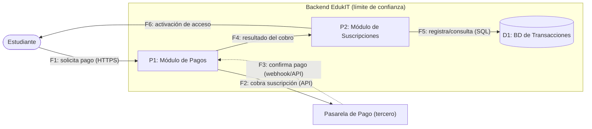

# 🗒️ Registro de Trabajo en Clase - Taller_5_Seguridad

## 📆 Fecha de la sesión
11/09/2026
## 👥 Integrantes presentes
- Esteban Díaz
- Juliana Moreno

## 🧠 Actividades realizadas en clase
 
Durante la sesión se aplicó la metodología de 5 pasos de la guía paso a paso sobre el caso base EdukIT. Se discutió cuál de los elementos sensibles del sistema (acceso a cursos, publicación de contenidos, pagos con terceros, almacenamiento de datos personales) ofrecía la mayor superficie de amenaza distinta a la ya cubierta por el ejemplo guiado de la guía (acceso a cursos), acordando trabajar el flujo de **procesamiento de pagos con terceros** por involucrar un actor externo adicional (la pasarela de pago) y datos financieros.
 
- Se discutió con el equipo el alcance del flujo a modelar: se decidió incluir la pasarela de pago externa como actor fuera del límite de confianza, para diferenciar el análisis del ejemplo ya resuelto en la guía.
- Como decisiones de modelado, se definieron dos procesos (Módulo de Pagos y Módulo de Suscripciones) y un único almacén de datos (BD de Transacciones), evitando fragmentar el DFD en más elementos de los necesarios para el nivel de detalle del taller.
- Se usó una herramienta de diagramación digital para construir el DFD del flujo y una hoja de cálculo con la plantilla oficial de 12 columnas para consignar las amenazas.
- Se alcanzó a completar el DFD, la identificación de los elementos (Paso 2) y la aplicación de las 6 categorías STRIDE con su escenario de ataque (Paso 3) para las seis amenazas (T1–T6). La evaluación de impacto, probabilidad y nivel de riesgo (Paso 4) y la priorización final (Paso 5) se completaron en la tabla `tabla-stride-clase.xlsx`, junto con la resolución del reto práctico en OWASP Juice Shop (reto 3 — acceso al carrito de otro usuario), relacionado con la amenaza T4 de Information Disclosure.
## 🧩 Boceto inicial del modelo
 
> El DFD del flujo de procesamiento de pagos con terceros representa al estudiante como actor externo, la pasarela de pago externa fuera del límite de confianza, y dentro del backend de EdukIT el Módulo de Pagos (P1), el Módulo de Suscripciones (P2) y la BD de Transacciones (D1), conectados por los flujos de datos de pago, cobro, confirmación, resultado del cobro, registro y activación de acceso.

Toda conexión que cruza el límite de confianza (F1, F2, F3) es un punto de análisis obligatorio.
  
 
## 🔁 Tareas definidas para complementar el taller
 
| Tarea asignada | Responsable | Fecha estimada |
|----------------|-------------|----------------|
| tabla-stride-cliente.xlsx | Esteban Díaz | 11/09 |
| Redacción del informe     | Juliana Moreno | 11/09 |
| Investigación y referencias | Juliana Moreno | 11/09 |
 
---
 
_Este documento resume el trabajo colaborativo realizado durante la sesión del Taller 5 en el curso AREM - Universidad de La Sabana._
